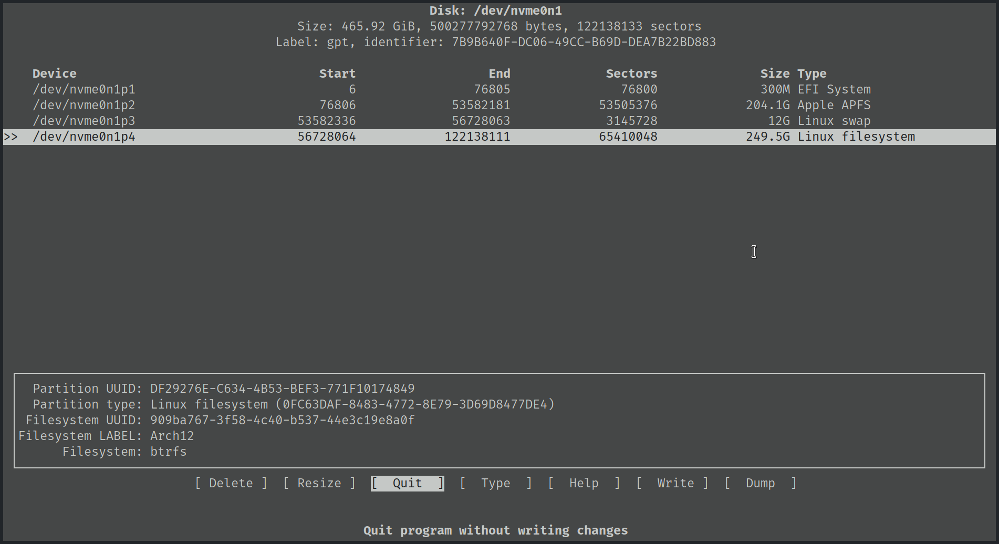
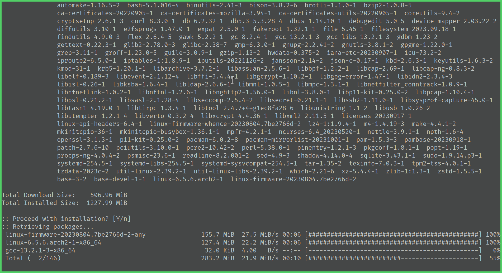
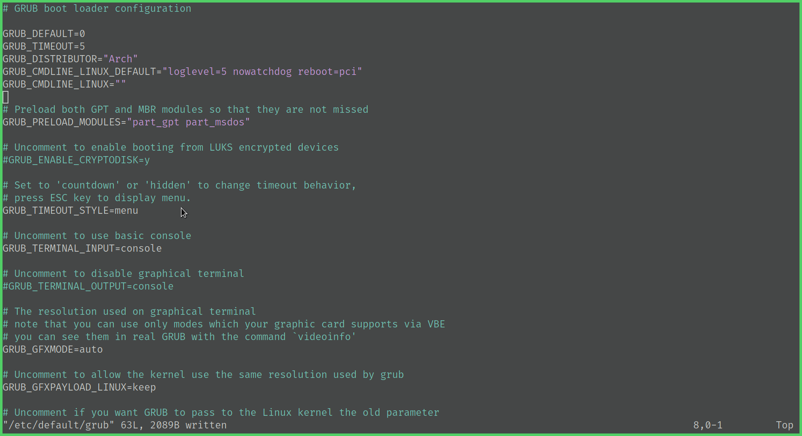
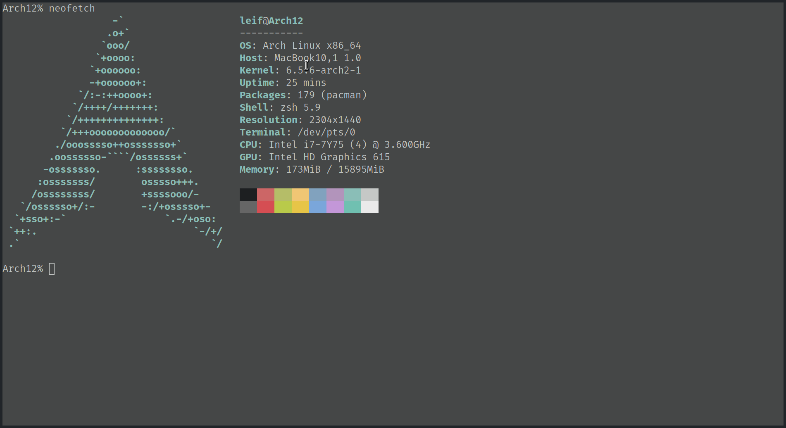

最近1年把工作和日常的主力机都换成了Archlinux，特别喜欢Linux下的平铺式窗口管理器。而在macOS下尝试过使用yabai配合skhd，相比之下还是觉得不够完善。

再加上手上两台Macbook笔记本已经步入晚年（一台Macbook Pro 2015 Early，一台Macbook 12寸 2017），操作上已经不再爽快，从而产生在Macbook上安装Archlinux的想法，实现所有设备操作模式的大一统😈️。

早在几个月前已经把比较老的Macbook Pro安装配置好Archlinux并使用一段时间，总体来说还是比较满意的。有了之前的经验，这次来折腾这台12寸Macbook，顺便记录一下过程。

---

安装教程参考：

- [官方wiki](https://wiki.archlinux.org/title/Mac)

- [Macbook 10,x安装教程](https://wiki.archlinux.org/title/MacBookPro10,x)

- [中文安装指南](https://arch.icekylin.online/guide/rookie/basic-install.html)

<br />

## 安装过程

### 禁用服务，修改软件源

```bash
systemctl stop reflector.service
iwctl
timedatectl set-ntp true
vim /etc/pacman.d/mirrorlist
# Server = https://mirrors.ustc.edu.cn/archlinux/$repo/os/$arch

# optional
pacman -Sy openssh fbset
fbset -xres 2304 -yres 1440
systemctl start sshd
```

<br />

### 分区

```bash
cfdisk /dev/nvme0n1
mkfs.fat -F32 /dev/nvme0n1p1
mkswap /dev/nvme0n1p2
mkfs.btrfs -L Arch12 /dev/nvme0n1p3
mount -t btrfs -o compress=zstd /dev/nvme0n1p3 /mnt
btrfs subvolume create /mnt/@
btrfs subvolume create /mnt/@home
umount /mnt
mount -t btrfs -o subvol=/@,compress=zstd /dev/nvme0n1p3 /mnt
mkdir /mnt/home
mount -t btrfs -o subvol=/@home,compress=zstd /dev/nvme0n1p3 /mnt/home
mkdir -p /mnt/boot
mount /dev/nvme0n1p1 /mnt/boot
swapon /dev/nvme0n1p2
```

第一次安装使用btrfs分区，但是nvme休眠后无法恢复状态。如果遇到SSD在休眠之后无法恢复，可以参考下文试试修改内核启动参数：

[[Solved] System gets borked after suspending](https://bbs.archlinux.org/viewtopic.php?id=278820)

[Controller_failure_due_to_broken_suspend_support](https://wiki.archlinux.org/title/Solid_state_drive/NVMe#Controller_failure_due_to_broken_suspend_support)

我尝试以上方法后仍然不行，所以第二次重装使用传统的ext4分区。

```bash
cfdisk /dev/nvme0n1
mkfs.ext4 /dev/nvme0n1p4
mkswap /dev/nvm0n1p3
mount --mkdir /dev/nvme0n1p1 /mnt/boot
swapon /dev/nvme0n1p3
```



<br />

### 安装系统

```bash
pacstrap /mnt base base-devel linux linux-firmware
pacstrap /mnt networkmanager vim sudo zsh zsh-completions
genfstab -U /mnt > /mnt/etc/fstab
```



<br />

### 配置系统

```bash
arch-chroot /mnt
```

```bash
ln -sf /usr/share/zoneinfo/Asia/Shanghai /etc/localtime
hwclock --systohc
vim /etc/hostname
vim /etc/hosts
vim /etc/locale.gen
locale-gen
echo 'LANG=en_US.UTF-8'  > /etc/locale.conf
passwd
pacman -S intel-ucode # Intel
pacman -S grub efibootmgr
grub-install --target=x86_64-efi --efi-directory=/boot --bootloader-id=ARCH --removable
vim /etc/default/grub
grub-mkconfig -o /boot/grub/grub.cfg
```



```bash
exit
```

```bash
umount -R /mnt
reboot
```

<br/>

### 完成基本安装


<br />

安装步骤和普通笔记本安装过程基本一样，由于我是macOS和Archlinux双系统，有几点要注意的：

1. 在macOS分区时候要选择partition

1. Archlinux安装过程中，注意原来苹果的EFI分区不要删掉。

1. 引导方式有几种，我选择了使用grub作为主引导。只要在grub-install时加上--removable参数，可以实现开机时按住"Alt"键切换成macOS引导。

1. 完成基础安装后，就是折腾各种驱动、软件、环境的配置了。

---

### 连接网络

```bash
systemctl enable --now NetworkManager
nmcli
```

从休眠状态恢复时，网络会断开，切NetworkManager卡死，无法重新连接网络。这是因为每次启动NetworkManager都会重新随机生成MAC地址。

[Configuring_MAC_address_randomization](https://wiki.archlinux.org/title/NetworkManager#Configuring_MAC_address_randomization)

[[SOLVED] MAC randomization, NM, IWD ?](https://bbs.archlinux.org/viewtopic.php?id=280657)

<br/>

---

## 常见问题与解决方法

设置[HiDPI](https://wiki.archlinux.org/title/HiDPI)
