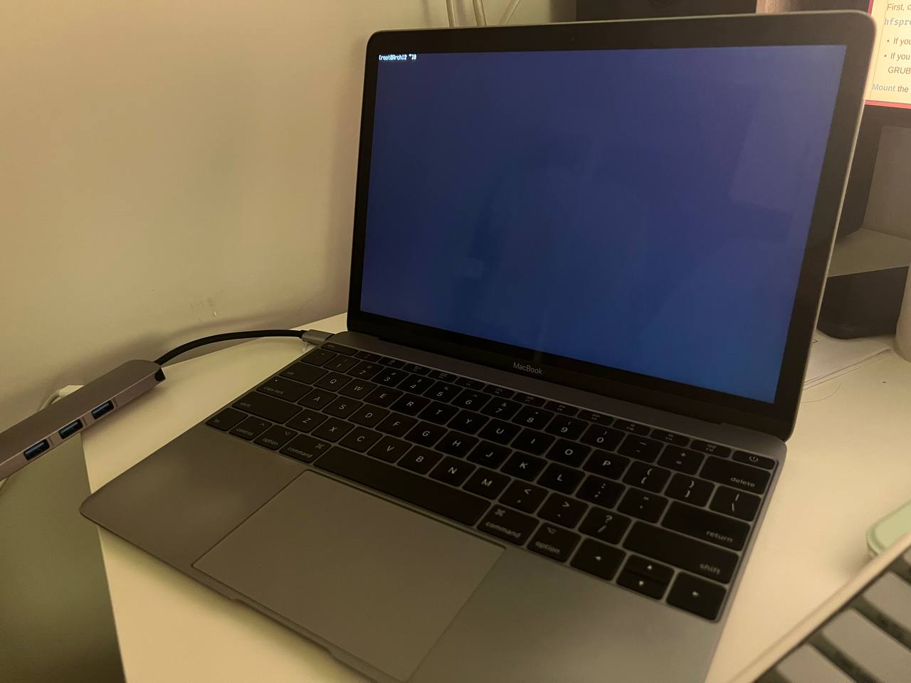

最近1年把工作和日常的主力机都换成了Archlinux，特别喜欢Linux下的平铺式窗口管理器。而在macOS下尝试过使用yabai配合skhd，相比之下还是觉得不够完善。

再加上手上两台Macbook笔记本已经步入晚年（一台Macbook Pro 2015 Early，一台Macbook 12寸 2017），操作上已经不再爽快，从而产生在Macbook上安装Archlinux的想法，实现所有设备操作模式的大一统😈️。

早在几个月前已经把比较老的Macbook Pro安装配置好Archlinux并使用一段时间，总体来说还是比较满意的。有了之前的经验，这次来折腾这台12寸Macbook，顺便记录一下过程。

---

安装教程参考：

- [官方wiki](https://wiki.archlinux.org/title/Mac)

- [中文安装指南](https://arch.icekylin.online/guide/rookie/basic-install.html)

 

↑ 完成基本安装

 

安装步骤和普通笔记本安装过程基本一样，由于我是macOS和Archlinux双系统，有几点要注意的：

1. 在macOS分区时候要选择partition

1. Archlinux安装过程中，注意原来苹果的EFI分区不要删掉。

1. 引导方式有几种，我选择了使用grub作为主引导。只要在grub-install时加上--remove参数，可以实现开机时按住"Alt"键切换成macOS引导。

1. 完成基础安装后，就是折腾各种驱动、软件、环境的配置了。
