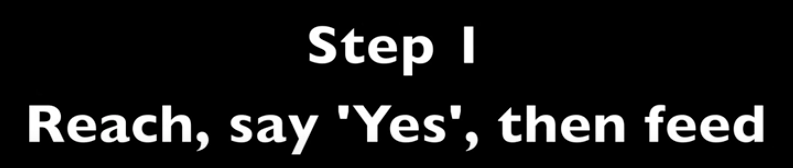
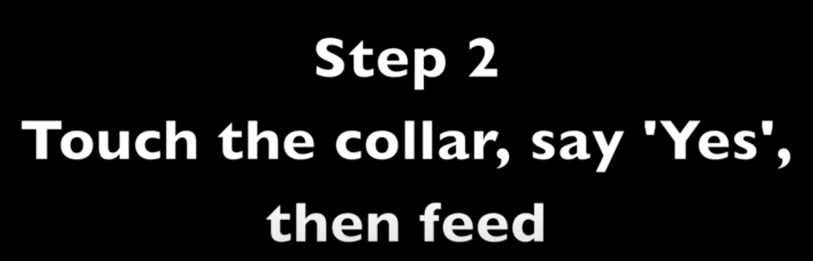
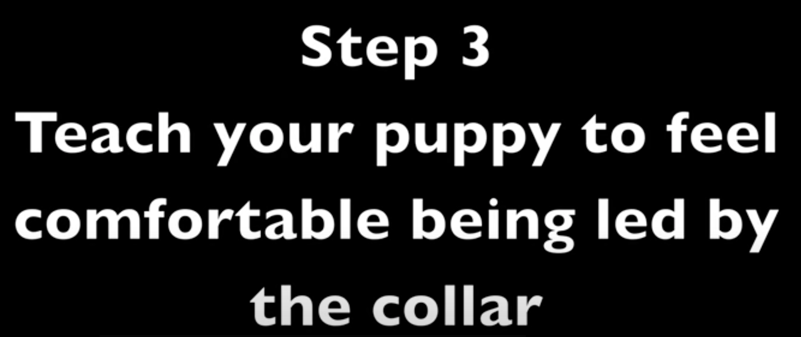
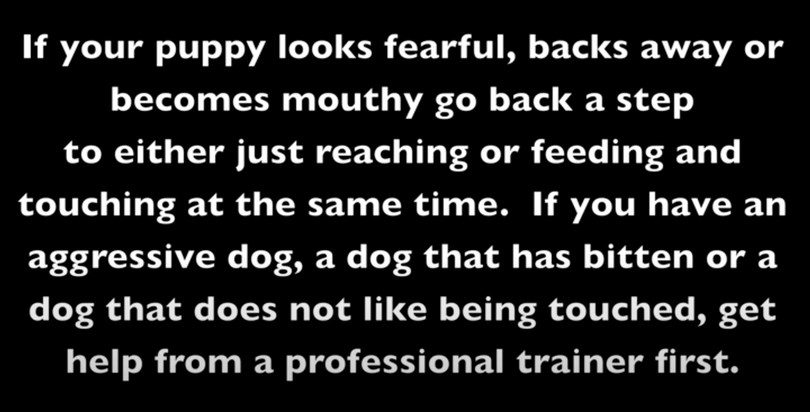
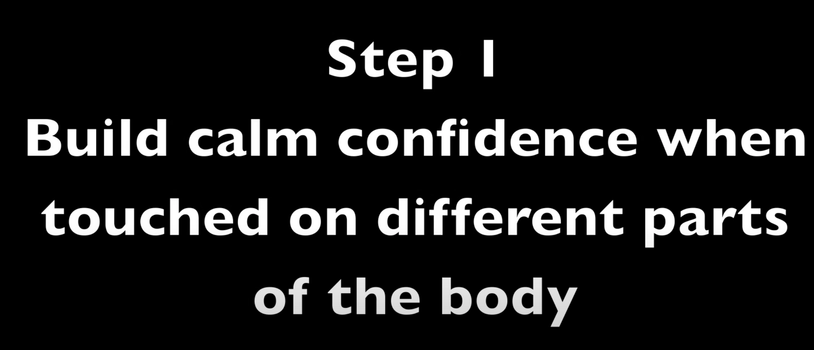
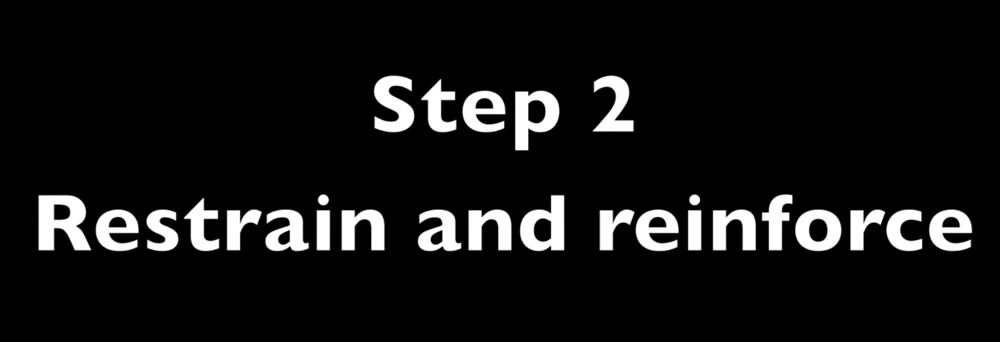
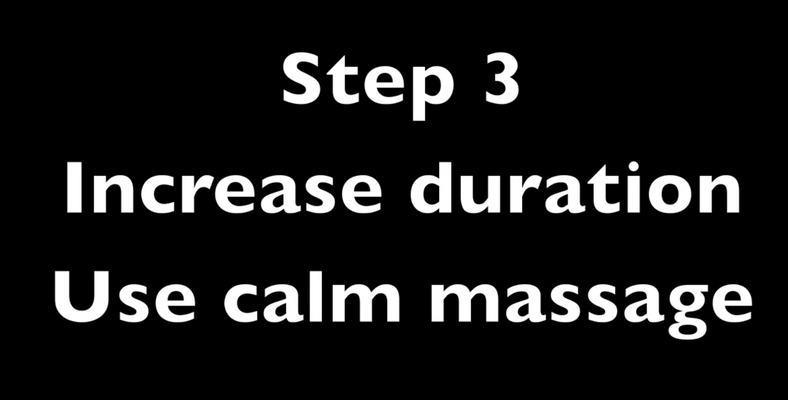
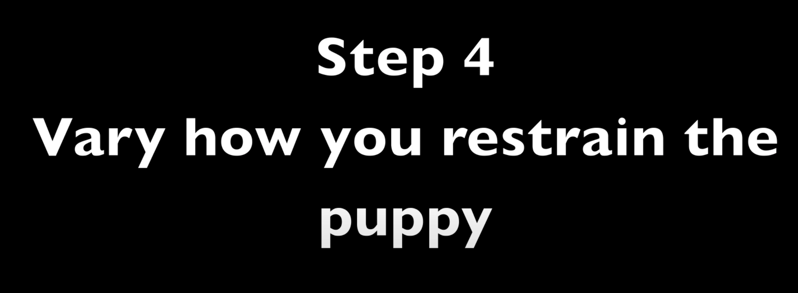
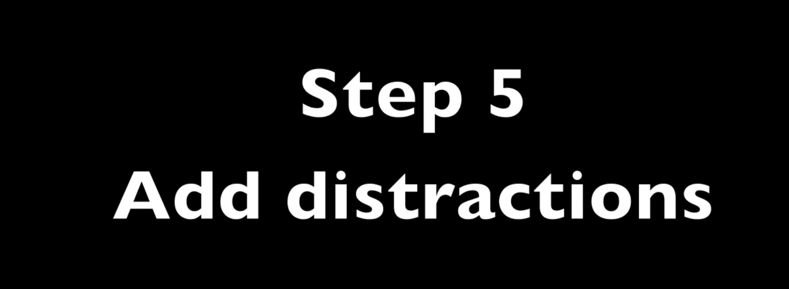

A lot of people believe that dogs should set up a pecking order, and then the humans should respect that order. However, what can happen is that the small arguments, intimidating glares and scuffles can go on forever. Some of the dogs feel the need to protect what they have, while others live in fear of stepping into the wrong place at the wrong time. This can actually sometimes be more stressful for the bullying dog than the dog being bullied. Instead of this, you can train the dogs default group behaviors. For example, everyone usually trains their dogs not to hover over them or steal their food when they are eating. You can train your dogs to respect each other when they are eating, in the same way that they respect the handler. By teaching and reinforcing the dogs for not bothering each other, the stress of living together decreases immensely. I will continue to focus on this concept in coming posts.

[How to teach dogs to wait for their turn for training](https://www.youtube.com/watch?v=MfRrBH_beX8)

[COLLAR GRAB - Teach your dog this important safety behavior - Dog Training](https://www.youtube.com/watch?v=62NNwZtbtIA)

**Some signs to back up a step in training**

- Tensing up
- Raising head upwards
- Unable to follow cues
- Unable to look away from the trigger
- Unable to look down to eat a treat on the ground
- Unable to look back after a marker
- Whining
- Barking
- Panting
- Other signs of stress

# Puppy training - Restraint

[youtube video](https://www.youtube.com/watch?v=G1Otlr6RX7o&t=51s)

